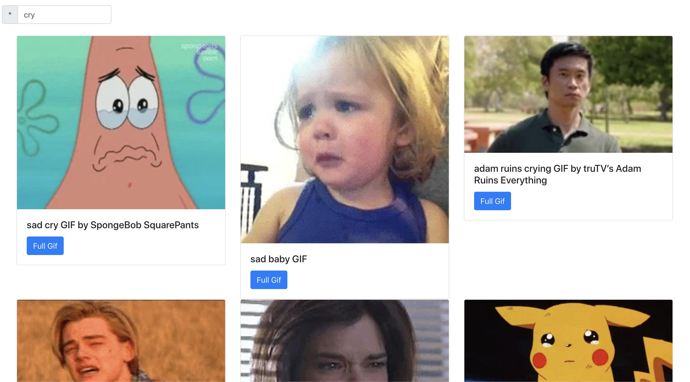

# reactapp-giphy

- This project is only a study project, to understand basic concepts of React and his ecosystem.
- The article that I've used to learn: https://www.taniarascia.com/getting-started-with-react/

## Demo
- You could see the result going to the URL https://erickwendel.github.io/reactapp-giphy

